<h1 align="center">🚀 Ziji | Electrical Engineer & Discord Bot Engineer & AE Editor</h1>

  

  

---

<table>
<tr>
<td width="50%">
  
</td>
<td width="50%">
   🔥 GitHub Stats:
  
  

    
    
  

  
---
  
 🌍 Connect with Me:
- 🌐 **Website:** [Ziji](https://ziji.world/)
- 💬 **Discord:** [Ziji](https://discord.gg/5bG56bKk)
- ▶ **YouTube:** [@ZijiStudio](https://www.youtube.com/@ZijiStudio) / [@ZijiNightcore](https://www.youtube.com/@ZijiNightcore)
- 🐦 **Twitter:** [@ZijiPia](https://twitter.com/ZijiNightcore)

---

⭐ **Fun Fact:** 

    for(;;){ keepCoding(); }

</td>
</tr>
</table>
